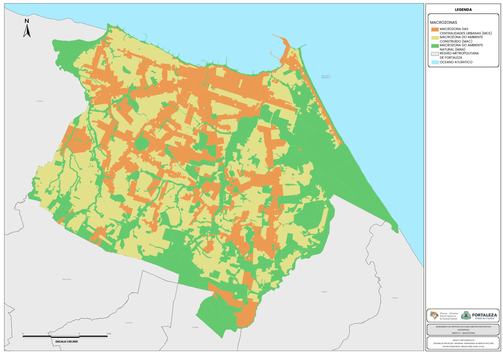

# 🏛️ Plano Diretor Participativo de Fortaleza - PDPFor (IPPLAN)

*Legenda: Mapa de Macrozoneamento oficial, fruto do trabalho da equipe técnica com foco na integração de indicadores ambientais e urbanísticos.*

## 📌 Contexto do Projeto
Este repositório documenta minha contribuição técnica junto à equipe do **Instituto de Planejamento de Fortaleza (IPPLAN)** na elaboração do novo Plano Diretor. O trabalho consistiu na espacialização de diretrizes urbanísticas, análise de restrições ambientais e consolidação do macrozoneamento da cidade.

## 🛠️ Atribuições e Contribuições Técnicas
Como integrante da equipe técnica de Geoprocessamento/Urbanismo, contribuí diretamente em:
* **Cartografia Temática:** Elaboração técnica de mapas de diagnóstico socioespacial e infraestrutura urbana.
* **Modelagem de Dados & Indicadores Ambientais:** Participação na concepção e desenvolvimento de fórmulas e métricas para quantificar a resiliência ambiental urbana, integrando variáveis de solo, vegetação e hidrografia para definição de Zonas de Preservação.
* **Análise de Zoneamento:** Espacialização das camadas de Uso e Ocupação do Solo conforme as diretrizes validadas em processos participativos.

## 🗺️ Resultados e Anexos Cartográficos
O trabalho conjunto da equipe técnica resultou no zoneamento oficial da cidade, consolidado nos anexos cartográficos da Minuta do Plano Diretor. Minha atuação focou na tradução de diretrizes teóricas em inteligência territorial:

* **Zoneamento Urbano:** Colaboração na definição espacial das áreas de adensamento, uso do solo e restrições ambientais.
* **Produção Cartográfica Oficial:** Elaboração dos mapas de macrozoneamento presentes nos anexos (**págs. 183 a 189** na numeração da Minuta), integrando camadas de dados socioeconômicos e ambientais.
* **Transparência de Dados:** Estruturação técnica dos mapas para garantir clareza na interpretação por gestores, legisladores e sociedade civil.

## 🔗 Links Oficiais e Transparência
O resultado consolidado deste esforço coletivo pode ser consultado nos canais oficiais:

* **[Minuta Ilustrada do Plano Diretor (Versão Completa)](https://drive.google.com/file/d/1jZFzz5YIM07e9JqfjzyHtWMXk5Obv8zs/view):** Documento contendo o detalhamento do zoneamento e anexos cartográficos (págs. 242-248 do PDF) desenvolvidos pela equipe.
* **[Lei Complementar nº 49/2025 - SAPL](https://sapl.fortaleza.ce.leg.br/media/sapl/public/materialegislativa/2025/108677/lc00492025.pdf):** Texto legal aprovado que institucionaliza as diretrizes e menciona os anexos técnicos.

## 👥 Equipe e Créditos
Este projeto é um esforço multidisciplinar realizado pelo corpo técnico do **IPPLAN Fortaleza**. Minha participação concentrou-se no suporte especializado em inteligência geospacial e análise territorial ambiental.

---
**Dra. Milena Monteiro Feitosa** | *PhD | Spatial Data Scientist*
*Palavras-chave: Planejamento Urbano | SIG | Gestão Territorial | Fortaleza*
