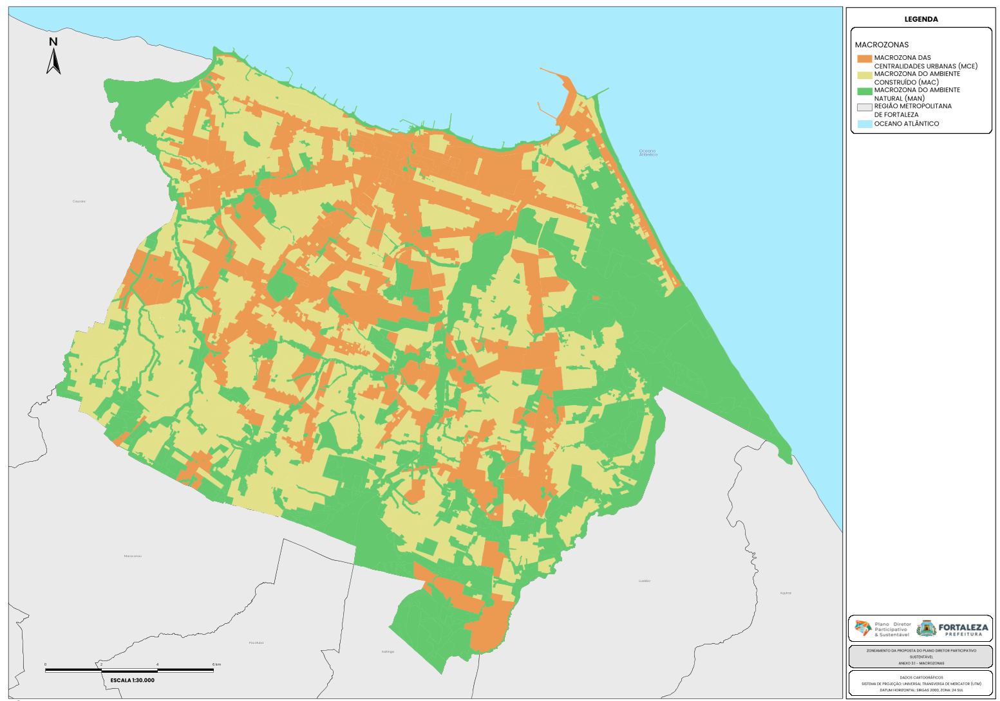

# Plano Diretor Participativo de Fortaleza — PDPFor (IPPLAN)

*Mapa de Macrozoneamento oficial — integração de indicadores ambientais e urbanísticos.*

## Contexto

Documentação da contribuição técnica junto ao **Instituto de Planejamento de Fortaleza (IPPLAN)**
na elaboração do novo Plano Diretor. O trabalho envolveu espacialização de diretrizes urbanísticas,
análise de restrições ambientais e consolidação do macrozoneamento da cidade.

## Contribuições técnicas

- **Cartografia temática:** elaboração de mapas de diagnóstico socioespacial e infraestrutura urbana.
- **Indicadores ambientais:** desenvolvimento de métricas para quantificar resiliência urbana,
  integrando variáveis de solo, vegetação e hidrografia para definição de Zonas de Preservação.
- **Análise de zoneamento:** espacialização das camadas de Uso e Ocupação do Solo conforme
  diretrizes validadas em processos participativos.

## Resultados

Elaboração dos mapas de macrozoneamento presentes nos anexos cartográficos da Minuta do Plano
Diretor (**págs. 183–189**), consolidando camadas de dados socioeconômicos e ambientais em
inteligência territorial aplicável por gestores, legisladores e sociedade civil.

## Documentos oficiais

- [Minuta Ilustrada do Plano Diretor](https://drive.google.com/file/d/1jZFzz5YIM07e9JqfjzyHtWMXk5Obv8zs/view) — zoneamento e anexos cartográficos (págs. 242–248 do PDF)
- [Lei Complementar nº 49/2025 — SAPL](https://sapl.fortaleza.ce.leg.br/media/sapl/public/materialegislativa/2025/108677/lc00492025.pdf) — texto legal aprovado

## Equipe

Projeto multidisciplinar do corpo técnico do IPPLAN Fortaleza. Atuação focada em
inteligência geoespacial e análise territorial ambiental.

---

**Stack:** Python · Geopandas · Google Earth Engine · QGIS · SIG
