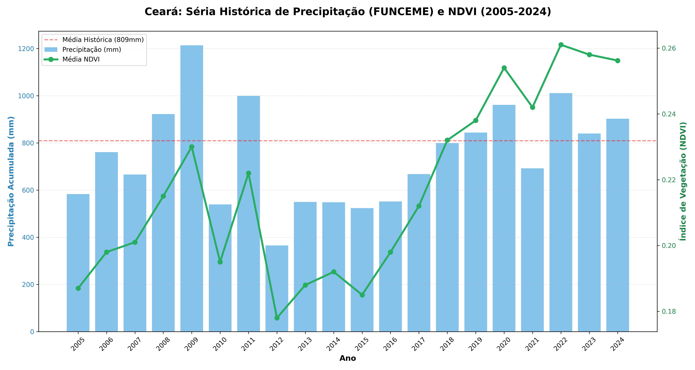
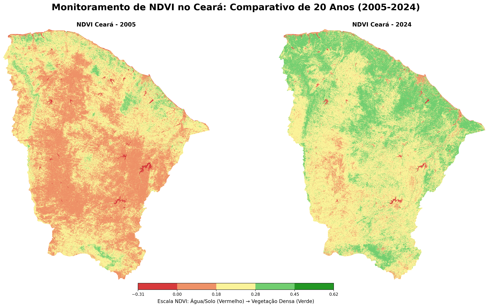

# 🌿 Monitoramento de Índices de Vegetação (NDVI) e Correlação Hidro-Climática no Ceará: Uma Abordagem via Google Earth Engine (2005 - 2024)

## 📌 Sobre o Projeto
Este repositório apresenta um estudo técnico de **Sensoriamento Remoto Orbital** focado na análise da evolução do vigor vegetativo no estado do Ceará. O projeto integra o processamento de índices de vegetação (NDVI) com séries históricas pluviométricas oficiais da **FUNCEME**, avaliando a resposta e a resiliência do bioma Caatinga frente à variabilidade climática das últimas duas décadas.

## 🚀 Metodologia e Fonte de Dados

### 🛰️ Sensoriamento Remoto via Python API (Google Earth Engine)
A extração e o processamento dos dados de refletância de superfície foram realizados utilizando a **API do Google Earth Engine para Python**. Esta abordagem permitiu a automação do fluxo de trabalho e a integração de dados multitemporais de três missões Landsat:
* **2005 - 2011:** Landsat 5 (TM)
* **2012:** Landsat 7 (ETM+)
* **2013 - 2024:** Landsat 8 (OLI/TIRS)

**Especificações Técnicas:**
* **Cálculo de Índice:** Normalized Difference Vegetation Index (NDVI).
* **Processamento em Nuvem:** Scripts para filtragem de nuvens, correção atmosférica e redução temporal.
* **Análise Local:** Exportação dos dados para processamento fino e estatística geoespacial via bibliotecas `pandas` e `rasterio`.

### 🌧️ Dados de Precipitação (FUNCEME)
* **Fonte:** Fundação Cearense de Meteorologia e Recursos Hídricos.
* **Dados:** Séries anuais de precipitação acumulada (mm) para os 184 municípios do Ceará.

## 📊 Análise de Resultados

### 1. Evolução do Vigor Vegetativo
A análise comparativa entre os anos extremos do estudo demonstra um incremento significativo na atividade fotossintética média do estado:
* **Média NDVI 2005:** 0.187 (Ano com índices pluviométricos abaixo da média)
* **Média NDVI 2024:** 0.256 (Pico de vigor vegetativo observado na série)
* **Variação:** Ganho de **+36.8%** no índice de vigor vegetativo médio estadual.

### 2. Resiliência do Bioma frente à Variabilidade Hídrica
O cruzamento de dados evidencia a **alta sensibilidade hídrica** da vegetação cearense. Embora o ciclo de seca severa (2012-2016) tenha impactado negativamente os índices de biomassa, os resultados recentes comprovam uma elevada **resiliência ambiental**, onde a sucessão de períodos favoráveis permitiu uma rápida regeneração do vigor vegetativo.

## 🖼️ Visualizações Finais

### Série Histórica de 20 Anos
Correlação entre a precipitação acumulada (barras) e a linha de tendência do vigor vegetativo (NDVI).

### Evolução do Vigor Vegetativo (Comparativo Geospacial)
Mapeamento da variação espacial do vigor vegetativo entre 2005 e 2024.
* **Simbologia:** Vermelho (Solo Exposto/Água) → Verde (Vegetação Ativa/Saudável).

---
**Análise desenvolvida por Milena Monteiro**
*Geoprocessamento | Sensoriamento Remoto | Python Data Science*