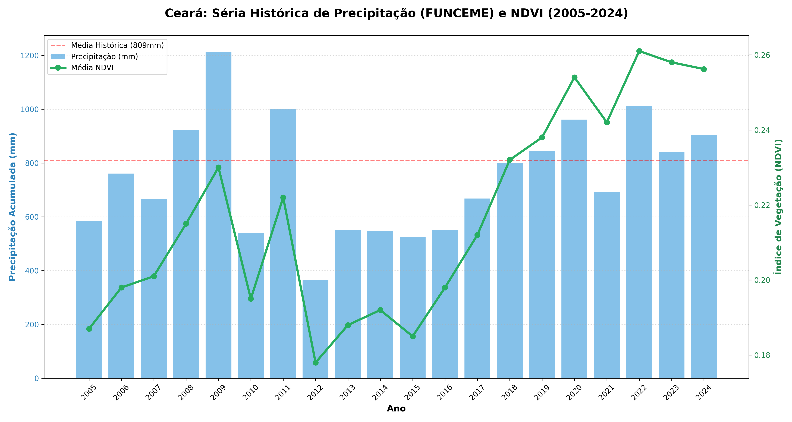
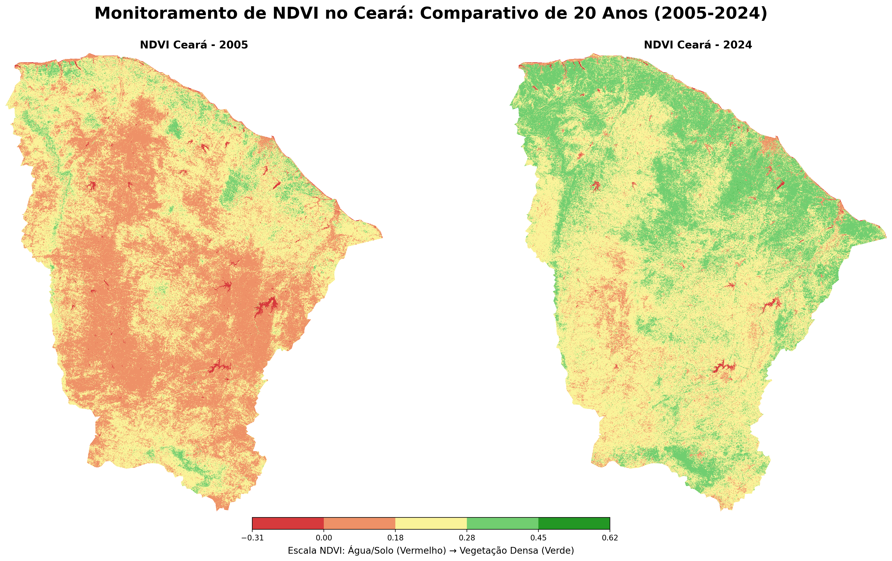

# Monitoramento NDVI e Correlação Hidro-Climática no Ceará (2005–2024)

Estudo de sensoriamento remoto orbital focado na evolução do vigor vegetativo no Ceará,
integrando índices NDVI com séries históricas pluviométricas da FUNCEME para avaliar
a resiliência da Caatinga frente à variabilidade climática das últimas duas décadas.

## Metodologia

**Sensoriamento Remoto — Google Earth Engine (Python API)**

Extração e processamento de dados de refletância de superfície via API do GEE,
com cobertura de três missões Landsat:

| Período | Missão |
|---------|--------|
| 2005–2011 | Landsat 5 (TM) |
| 2012 | Landsat 7 (ETM+) |
| 2013–2024 | Landsat 8 (OLI/TIRS) |

Pipeline: filtragem de nuvens → correção atmosférica → redução temporal → exportação
para análise estatística local via `pandas` e `rasterio`.

**Dados de Precipitação**

Séries anuais de precipitação acumulada (mm) para os 184 municípios do Ceará — Fonte: FUNCEME.

## Resultados

| Indicador | 2005 | 2024 | Variação |
|-----------|------|------|----------|
| Média NDVI estadual | 0,187 | 0,256 | +36,8% |

O ciclo de seca severa (2012–2016) impactou negativamente os índices de biomassa,
mas os resultados recentes evidenciam alta resiliência ambiental: períodos favoráveis
subsequentes permitiram rápida regeneração do vigor vegetativo.

## Visualizações

**Série histórica — 20 anos**

Correlação entre precipitação acumulada (barras) e tendência do NDVI.

**Comparativo geoespacial — 2005 vs. 2024**

Variação espacial do vigor vegetativo. Simbologia: vermelho (solo exposto) → verde
(vegetação ativa).

---

**Stack:** Python · Google Earth Engine API · Pandas · Rasterio · Geopandas
